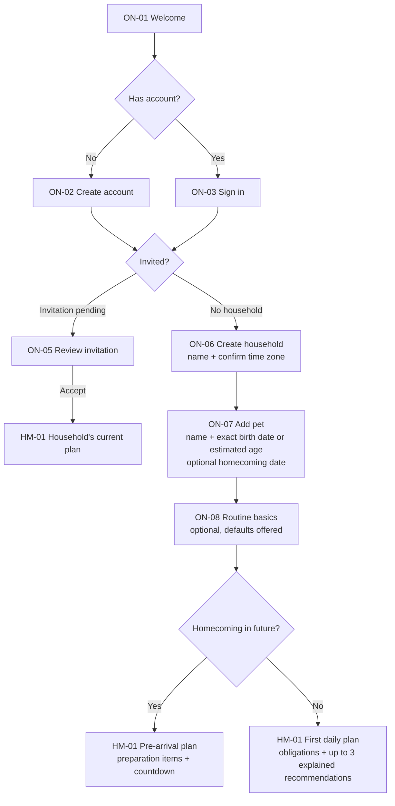
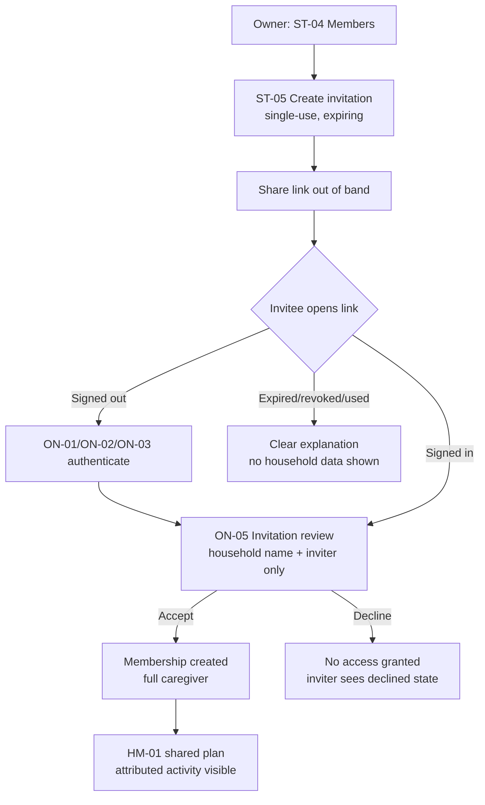
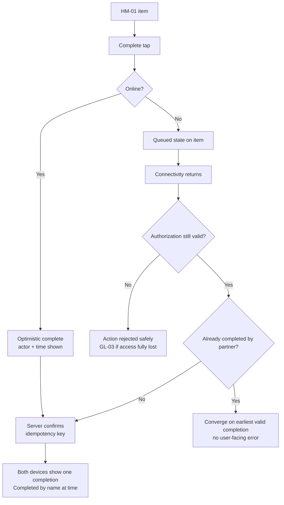
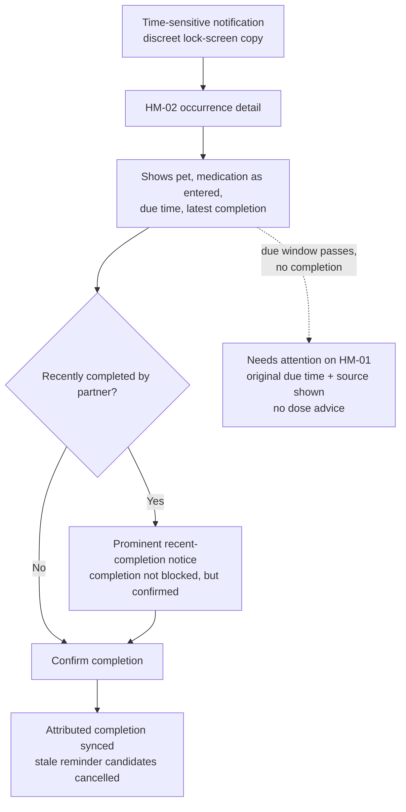

# Information Architecture

**Status:** Review  
**Version:** 1.0  
**Last updated:** 2026-07-26  
**Related documents:** [Product Requirements Document](00-product-requirements-document.md),
[Core Features](03-core-features.md), [User Stories](04-user-stories.md),
[Daily Plan Engine](12-daily-plan-engine.md), [Data Model](10-data-model.md),
[Decision Log](13-decision-log.md)

## 1. Purpose

This document defines the navigation model, screen inventory, screen ownership,
content hierarchy, entry points, system states, and end-to-end flows for the
PetCompanion MVP. It is written so that wireframing, visual design, and
implementation can proceed without inventing missing product structure.

## 2. Scope

- Mobile-first application structure for the private MVP (Slices A–E as defined
  in [Core Features §20](03-core-features.md)).
- Single-pet and multi-pet behavior within one household.
- Pre-arrival and post-arrival behavior.
- Deep-link and notification destinations.
- Empty, loading, offline, stale, error, and permission-denied states.

### Explicit exclusions

- Visual design, wireframes, and component specifications
  (see [UI Design System](09-ui-design-system.md)).
- Web, tablet-optimized, or watch experiences.
- Deferred features: AI coach, marketplace, social feed, professional portals,
  multi-species UI, poster scanning, wearables.
- The Insights pillar as a navigable surface (post-MVP; see §13).

## 3. Dependencies

- Plan structure, sections, capacity modes, and item lifecycle:
  [Daily Plan Engine](12-daily-plan-engine.md) §6, §13, §16.
- Feature boundaries and acceptance criteria: [Core Features](03-core-features.md).
- Story-level acceptance criteria: [User Stories](04-user-stories.md).
- Entity definitions referenced by screens: [Data Model](10-data-model.md).

## 4. Navigation principles

Derived from the product principles in the PRD:

1. **Home answers "what should we do today?"** The Daily Plan is the first
   screen after launch and the center of the product. Nothing competes with it.
2. **Frequency earns placement.** A destination is top-level only if a typical
   household uses it at least weekly. Setup, configuration, and rare records are
   contextual.
3. **One concept per destination.** No destination duplicates another's content;
   cross-links navigate to the owning surface rather than re-rendering data.
4. **Never more than five top-level destinations.** This matches platform tab
   conventions and the reduce-cognitive-load principle.
5. **Depth over breadth for records.** Health, grooming, and profile records sit
   behind a single Care hub instead of fragmenting into parallel tabs.
6. **Pet context is ambient, not repeated.** Pet-scoped surfaces share one
   active-pet context; single-pet households never see pet-switching chrome.

## 5. Navigation model

### 5.1 Evaluation of the candidate model

The prior candidate — Home, Pets, Training, Planner, Life, Profile — was
evaluated against the PRD §10 journeys and the principles above. It fails on
three points:

- **Six destinations exceed the five-slot convention** and force either a
  "More" overflow or cramped tab targets.
- **Pets and Profile are low-frequency surfaces.** Pet profile editing and
  account settings are setup-time and rare-correction activities (US-020,
  US-023, US-101). They do not earn permanent slots, while health and care
  recording (E07, weekly or more) has no direct route in that model — the exact
  concern raised in PRD §11.
- **"Pets" is ambiguous.** It reads as profile management but would have to
  carry health records to be useful, blurring ownership.

### 5.2 Adopted model (Proposed decision — see Decision Log)

Five bottom-tab destinations plus a contextual Profile entry:

| Tab | Owns | Core journeys served |
| --- | --- | --- |
| **Home** | Daily Plan, capacity, plan history, development stage | PRD 10.3 daily use; US-030–US-041 |
| **Planner** | Calendar, tasks, events, recurrence editing | PRD 10.6; US-050–US-055, US-080–US-086 |
| **Training** | Skill catalogue, goals, sessions, socialization passport | PRD 10.4; US-060–US-068 |
| **Care** | Pet profile, health records, medications, weight, grooming, providers | PRD 10.5; US-020–US-025, US-070–US-078 |
| **Life** | Timeline, milestones, journal, media | US-090–US-095 |

**Profile & Settings** (account, household, members, invitations,
notifications, privacy, data control) opens from a persistent avatar entry in
the Home header and from deep links. It is a full navigation stack, not a tab.

Tab order is fixed: Home, Planner, Training, Care, Life. Home is the launch
destination whenever the user has an active household and pet.

### 5.3 Global navigation elements

- **Tab bar** — always visible on top-level screens; hidden inside modal flows
  (editors, onboarding, media viewer).
- **Pet context switcher** — appears in the header of pet-scoped tabs (Home,
  Training, Care, Life) only when the household has more than one active pet.
  See §11.
- **Profile entry** — avatar button in the Home header; also reachable from a
  header overflow on other tabs.
- **Quick add** — a "+" action on Home and Planner opening one sheet with:
  Task, Event, Training session, Socialization experience, Health record,
  Weight, Milestone. Each option routes to the owning editor with pet context
  pre-filled.
- **Sync status** — a subtle stale/queued indicator surfaced in the Home header
  region when state cannot be verified (US-106); never a blocking banner.

## 6. Screen inventory

Screen IDs are stable references for wireframes, stories, and implementation.
"Slice" is the first release slice in which the screen ships
([Core Features §20](03-core-features.md)).

### 6.1 Onboarding and access stack (no tab bar)

| ID | Screen | Purpose | Features | Key stories | Slice |
| --- | --- | --- | --- | --- | --- |
| ON-01 | Welcome | Value proposition; route to create account, sign in, or accept invitation | F01 | US-001 | A |
| ON-02 | Create account | Register an individual account | F01 | US-001 | A |
| ON-03 | Sign in | Authenticate a returning user | F01 | US-002 | A |
| ON-04 | Account recovery | Regain access via the identity provider's verified method | F01 | US-003 | B |
| ON-05 | Invitation review | Show inviting household name and inviter; accept or decline | F02 | US-012 | B |
| ON-06 | Create household | Name the household; confirm time zone (explicit default shown) | F02 | US-010 | A |
| ON-07 | Add pet | Minimal profile: name, dog, exact birth date **or** estimated age; optional homecoming date | F03 | US-020, US-021, US-022 | A |
| ON-08 | Routine basics | Optional broad meal/potty/wake/sleep windows; skippable with reviewed defaults | F13 | US-100 | A |
| ON-09 | Notification primer | Explain value before the platform permission prompt; skippable | F11 | US-085 | D |

Onboarding ends by landing on HM-01 with the first generated plan (Scenario A).
A user who declines every optional step still reaches a valid plan (US-030).

### 6.2 Home stack

| ID | Screen | Purpose | Features | Key stories | Slice |
| --- | --- | --- | --- | --- | --- |
| HM-01 | Daily Plan (Home) | The day's plan for the active pet in engine section order | F04, F06 | US-030–US-036, US-108 | A |
| HM-02 | Plan item detail | Full detail for any occurrence or recommendation: source, due window, assignment, note, actions | F04, F05 | US-032–US-035, US-053, US-054 | A |
| HM-03 | "Why this?" explanation | Plain-language reason, recent history, effort; pause/replace controls | F04 | US-037, US-038 | C |
| HM-04 | Capacity selector | Normal / Busy / Essentials only; today-only or set as default | F04 | US-036 | C |
| HM-05 | Plan history | Read-only previous days with dispositions and attribution | F04 | US-040 | C |
| HM-06 | Development stage & timeline | Current stage, focus areas, next-stage preview, links to actions | F07 | — (F07 criteria) | C |
| GL-01 | Quick add sheet | Route to the owning editor with context pre-filled | F05 | US-050 | A |
| GL-02 | Pet switcher sheet | Change the active pet context | F03 | — | A (model), UI when >1 pet |

### 6.3 Planner stack

| ID | Screen | Purpose | Features | Key stories | Slice |
| --- | --- | --- | --- | --- | --- |
| PL-01 | Calendar | Agenda-first view of occurrences and events by day; month jump; pet badges | F11 | US-080 | D |
| PL-02 | Task editor | Create/edit one-time and recurring tasks; explicit recurrence options with human-readable summary; this-occurrence vs this-and-future chooser on edit | F05 | US-050, US-051, US-054, US-055 | A (create), D (recurrence UI) |
| PL-03 | Event editor | Create/edit events: title, pet, date, optional time, location, notes, reminder lead times | F11 | US-081, US-086 | D |
| PL-04 | Event detail | Event with linked preparation tasks and reminder summary | F11 | US-074, US-086 | D |

Occurrence detail is HM-02, opened from Planner as well — one screen, two entry
points.

### 6.4 Training stack

| ID | Screen | Purpose | Features | Key stories | Slice |
| --- | --- | --- | --- | --- | --- |
| TR-01 | Training overview | Active goals with progress states, recent sessions, suggested next practice, entry to catalogue and socialization | F08 | US-061, US-065 | C |
| TR-02 | Skill catalogue | Browse by group; search; prerequisite and review-status badges | F08 | US-060 | C |
| TR-03 | Skill lesson | Steps, prerequisites, stage guidance, effort, common mistakes, content version/review status; start goal; log session | F08 | US-060–US-062 | C |
| TR-04 | Log training session | Date, optional duration, progress state, note, optional media | F08, F12 | US-063 | C |
| TR-05 | Skill progress history | Session list and progress-state changes with attribution | F08 | US-065 | C |
| TR-06 | Socialization passport | Category grid with breadth-by-category view (no numeric score) | F09 | US-066 | C |
| TR-07 | Category experiences | Suggested and custom experiences; caution content where reviewed; pause/unsuitable controls | F09 | US-066, US-068 | C |
| TR-08 | Record experience | Date, context, response, note, optional media | F09 | US-067 | C |

### 6.5 Care stack

| ID | Screen | Purpose | Features | Key stories | Slice |
| --- | --- | --- | --- | --- | --- |
| CA-01 | Care overview | Pet header (photo, age, stage), upcoming care, recent records, entry to all record types and providers | F03, F10 | US-070–US-078 | A (minimal), D (full) |
| CA-02 | Pet profile | View/edit profile fields; exact-vs-estimated age; homecoming date; archive entry | F03 | US-020–US-025 | A |
| CA-03 | Health records list | Filterable list across record types with provenance badges | F10 | US-070, US-077 | D |
| CA-04 | Health record detail | Full record, provenance, attachments, change history where required | F10 | US-070, US-077 | D |
| CA-05 | Health record editor | Typed forms: vaccination, preventive care, grooming, general note, document | F10 | US-070, US-076, US-077 | D |
| CA-06 | Medication schedule detail | Medication as entered, schedule, last completion, change history, archive action | F10 | US-071–US-073, US-078 | D |
| CA-07 | Medication schedule editor | Name, dose as entered, schedule from supported recurrence only; unsupported patterns refused, never approximated | F10, F05 | US-071 | D |
| CA-08 | Weight & growth | Dated entries with units preserved; simple non-clinical visualization | F10 | US-075 | D |
| CA-09 | Providers | Veterinarian and other care contacts | F10 | US-073, US-074 | D |

### 6.6 Life stack

| ID | Screen | Purpose | Features | Key stories | Slice |
| --- | --- | --- | --- | --- | --- |
| LF-01 | Life timeline | Chronological milestones, sessions, records, and media by effective date; type filters | F12 | US-092 | E |
| LF-02 | Milestone detail | Milestone with media; edit; remove attachment | F12 | US-090, US-093 | E |
| LF-03 | Milestone editor | Title, pet, date, note, optional photo; text saves even when upload fails | F12 | US-090, US-091 | E |
| LF-04 | Journal entry editor | Free-form entry (P2) | F12 | US-094 | Post-E |
| LF-05 | Media viewer | Full-screen media with capture date; remove-attachment flow | F12 | US-091, US-093 | E |

### 6.7 Profile & settings stack (from Home header avatar)

| ID | Screen | Purpose | Features | Key stories | Slice |
| --- | --- | --- | --- | --- | --- |
| ST-01 | Profile & settings hub | Account summary; household section; entries to all settings | F01, F13 | US-102 | B |
| ST-02 | Account settings | Display name, credentials via provider, sign out, delete account (with household-consequence explanation) | F01 | US-004 | B |
| ST-03 | Household settings | Name, time zone, routine windows, default capacity | F13 | US-100 | B |
| ST-04 | Members & invitations | Active and pending members with roles; remove; transfer ownership; leave | F02 | US-013–US-015, US-102 | B |
| ST-05 | Invite caregiver | Create and share a single-use expiring invitation; revoke pending | F02 | US-011 | B |
| ST-06 | Notification preferences | Per-user: morning summary opt-in and window, reminder defaults, quiet hours, lock-screen detail level, completion updates | F11 | US-082, US-084, US-101, US-109 | D |
| ST-07 | Privacy & data | Export, archive/delete pet, close household, policy links | F13 | US-103, US-104, US-025 | E |
| ST-08 | About & guidance boundaries | App version, content provenance explanation, veterinary-boundary statement | F13 | — | E |

### 6.8 Access-failure screen

| ID | Screen | Purpose | Slice |
| --- | --- | --- | --- |
| GL-03 | No access | Shown when authorization fails (removed member, closed household, dead deep link); explains neutrally, routes to household creation or invitation entry; never leaks household data | B |

## 7. Content hierarchy of key screens

### 7.1 Home (HM-01)

Top to bottom, matching [Daily Plan Engine §6](12-daily-plan-engine.md):

1. **Header:** greeting, pet name and photo, age and stage chip (opens HM-06),
   avatar (opens ST-01), sync-status indicator when relevant.
2. **Needs attention** — only when present; visually distinct; never styled as
   an error for the whole day.
3. **Today** — required and scheduled items, grouped into Morning / Midday /
   Afternoon / Evening / Anytime windows when useful.
4. **Recommended** — at most the capacity budget (3 / 1 / 0); each card shows
   category, effort band, and a "Why this?" affordance; an "another idea"
   action supports replacement (US-038) without growing the plan.
5. **Coming up** — up to three future items in chronological order.
6. **Completed** — collapsed; expandable; shows actor and time
   ("Completed by Sarah at 7:42 AM").

Empty sections are hidden. Capacity control lives in a header-adjacent
affordance (opens HM-04). Primary action per item card: complete. Secondary
actions (skip, snooze, reschedule, detail) via the card's detail screen or a
long-press/swipe action defined in design.

### 7.2 Care overview (CA-01)

1. Pet header (photo, name, age/stage, edit profile entry).
2. Upcoming care (next medication occurrences, next appointment).
3. Medications (active schedules).
4. Recent records with provenance badges.
5. Record-type entries: vaccinations, weight, grooming, notes, documents,
   providers.

### 7.3 Training overview (TR-01)

1. Active goals with progress states.
2. Suggested next practice (engine-eligible, explanation available).
3. Recent sessions.
4. Entries: catalogue (TR-02), socialization passport (TR-06).

## 8. Primary and secondary actions by destination

| Destination | Primary action | Secondary actions |
| --- | --- | --- |
| Home | Complete a plan item | Undo, skip, snooze, reschedule, pin, replace recommendation, change capacity, open explanation |
| Planner | Add task or event | Edit occurrence, edit series (this vs future), open detail |
| Training | Log a session | Start/pause goal, browse catalogue, record socialization |
| Care | Add a health record | Edit profile, manage medication schedule, add weight, archive schedule |
| Life | Add a milestone | Add photo, browse timeline, remove attachment |
| Settings | Invite a caregiver | Edit routines, notification preferences, export, destructive flows |

## 9. Entry points

| Surface | Entry points |
| --- | --- |
| HM-01 | App launch; tab; morning-summary notification; completion-update notification |
| HM-02 | Plan item tap; time-sensitive reminder notification; Planner item tap |
| PL-04 | Calendar tap; event reminder notification; Coming up item tap |
| CA-06 | Care overview; medication reminder deep link (via HM-02 occurrence context) |
| ON-05 | Invitation link (signed-in and signed-out paths); pending-invitation prompt after sign-in |
| ST-04 | Settings hub; membership-change notification |
| HM-06 | Stage chip on Home; Care overview link |
| GL-01 | "+" on Home and Planner |

Every notification destination must survive the target being gone: if the
underlying item was completed, cancelled, or the user lost authorization, the
destination shows current truthful state (HM-02 with completed state, or
GL-03) rather than an error.

## 10. Deep-link and notification destination map

Notification classes from [Daily Plan Engine §21](12-daily-plan-engine.md):

| Notification class | Destination | Behavior on arrival |
| --- | --- | --- |
| Daily Plan morning summary | HM-01 (pet-scoped) | Sets active pet context to the summarized pet |
| Time-sensitive required care | HM-02 for the occurrence | Shows pet, medication/care context, last completion before any action (US-072) |
| Confirmed event reminder | PL-04 | Shows current (possibly rescheduled) event state |
| User-requested task reminder | HM-02 | Standard occurrence detail |
| Optional recommendation (rare) | HM-01 | Never a modal |
| Household completion update (opt-in) | HM-01, Completed expanded | — |
| Invitation events | ON-05 (invitee) / ST-04 (owner) | Auth-gated |

Deep-link rules:

- All deep links are auth-gated; unauthenticated users pass through ON-03 and
  return to the destination.
- Authorization is checked server-side at open; failure routes to GL-03 with no
  household data in the failure copy (Scenario F).
- Lock-screen copy follows the user's detail-level preference (US-109);
  discreet by default for health items.

## 11. Single-pet and multiple-pet behavior

- The data model is multi-pet from Slice A; the UI is optimized for one pet.
- **Active pet context** is a per-device, per-user selection applying to Home,
  Training, Care, and Life. Planner is household-wide with per-item pet badges
  (US-080).
- With exactly one active pet: no switcher chrome anywhere; the pet header is
  informational.
- With two or more: the pet header becomes the switcher (GL-02). Switching
  changes context across all pet-scoped tabs at once. Each pet has its own plan
  (engine §14.4); completion always binds to the pet on the item, not the
  ambient context.
- A combined multi-pet Home is explicitly out of MVP scope (engine open
  question); the IA reserves the Home header as the future surface for it.
- Archived pets disappear from the switcher and pet-scoped tabs but remain
  reachable through ST-07 → archived pets → read-only history (US-025).

## 12. Household and caregiver surfaces

- **Membership visibility (US-013, US-102):** ST-04 lists active members with
  roles and pending invitations, visually distinguished.
- **Invitation (US-011, US-012):** owner-only by default. ST-05 creates a
  single-use, expiring invitation shared as a link. The invitee flow (ON-05)
  shows household name and inviter only — no pet records before acceptance.
- **Attribution:** every shared completion, note, and schedule change shows the
  acting member by display name throughout Home, Planner, Care, and history
  surfaces. Factual copy only; no leaderboards or caregiver statistics.
- **Removal and leaving (US-014, US-015):** ST-04, owner-gated, with
  confirmation identifying the member. Ownership transfer must precede the
  final owner leaving; the flow enforces this ordering.
- **Per-user preferences:** notification settings (ST-06) always belong to the
  individual user, never the household (US-101).

## 13. MVP navigation versus contextual functionality

Top-level in MVP: the five tabs in §5.2. Everything else is contextual:

| Capability | Placement | Reason |
| --- | --- | --- |
| Profile, account, household settings | Avatar entry → ST stack | Low frequency |
| Pet profile | Inside Care (CA-02) | Setup-time and rare edits |
| Development timeline | Stage chip on Home → HM-06 | Consumed in context of "today" |
| Capacity modes | Sheet from Home (HM-04) | A modifier of the plan, not a place |
| Socialization | Inside Training (TR-06) | One practice discipline, shared engine |
| Insights | **Not in MVP navigation.** Weight visualization lives in CA-08; other insights deferred | Avoids a vanity-chart tab before there is data worth acting on |
| Search | Within the Training catalogue only | No global search in MVP |
| Export, deletion, household close | ST-07 | Deliberate, confirmed flows |

Adding any new top-level destination is a material decision requiring a
Decision Log entry.

## 14. Pre-arrival and post-arrival behavior

Driven by the pet's homecoming date ([Data Model](10-data-model.md), Pet):

**Pre-arrival mode** (homecoming date in the future, US-022, engine §26.1):

- Home header shows a homecoming countdown instead of daily-care framing.
- The plan contains preparation obligations and preparation recommendations
  only; feeding/potty/routine care items are suppressed unless manually
  scheduled.
- Training shows preview content ("what you can prepare"), not session logging
  prompts. Care supports record entry (breeder documents, first appointment).
  Life is available (first photos are common before homecoming).
- Transition to post-arrival happens automatically on the homecoming date, with
  a confirmation moment on first open that day ("Maple is home! Set up your
  daily routine") that offers routine confirmation (ON-08 content, re-entrant).

**Post-arrival** is the default experience described throughout this document.
Changing the homecoming date recalculates future preparation without rewriting
history (US-022).

> **Priority note (resolved 2026-07-26):** the pre-arrival plan variant is
> part of Slice A — see the pre-arrival decision in the
> [Decision Log](13-decision-log.md). Expanded preparation content breadth
> remains P2.

## 15. System states

### 15.1 Global framework

Every screen defines these states; the table gives the default behavior, and
§15.2 lists surface-specific overrides.

| State | Default behavior |
| --- | --- |
| Loading | Lightweight skeleton of the expected layout; no spinners over blank screens; cached content shown immediately when available |
| Empty | Calm, specific copy naming what would appear and one constructive action; never error styling (US-108) |
| Offline | Last-synchronized content remains readable; supported actions queue with visible "queued" state; unsupported actions disabled with explanation (US-058) |
| Stale | Subtle last-synchronized indicator when state cannot be verified; no claims about what other caregivers have or have not done (US-106) |
| Error (read) | Retained last-good content where possible plus a retry affordance; failure copy says what to do next (US-107) |
| Error (write) | Action resolves to confirmed saved, queued, or failed — never ambiguous; retries use idempotency keys and cannot duplicate records |
| Permission denied (authorization) | GL-03; no household data in copy |
| Permission denied (platform: notifications, camera, photos) | Feature-specific explanation at point of use; core flow continues without the capability; no repeated prompting (US-085, US-091) |

### 15.2 Surface-specific behavior

| Surface | State | Behavior |
| --- | --- | --- |
| Home | Empty (nothing due) | "You're all caught up" success state with add-task and browse-ideas actions; no filler work (engine §25.2) |
| Home | Recommendations unavailable | Saved obligations still render; Recommended section hidden; quiet diagnostic logged (engine §25.3, §25.4) |
| Home | Insufficient profile info | Required household tasks show; a single inline prompt asks for the smallest missing input (engine §25.1) |
| Home | Offline | Entire plan readable; complete/skip/note queue locally; badge on queued items |
| Planner | Empty day | Date shown with quick-add; adjacent days' items still visible in agenda |
| Training catalogue | Content unavailable | Cached catalogue if any; otherwise explanation and retry; logged sessions remain visible |
| Care | Medication list, offline | Schedules and last-known completions readable; completion queues; stale indicator mandatory on last-completion display |
| Life | Media missing/failed | Text records render with placeholder; per-item retry (US-090, Scenario H) |
| Any notification target | Item gone | Truthful current state, not an error (see §10) |

## 16. Accessibility

Target: WCAG 2.2 AA (PRD §13.3). IA-level requirements:

- All five tabs and the profile entry have accessible names and reachable focus
  order; the tab bar is never the only route to content that a deep link can
  reach.
- Obligation classes (required / scheduled / recommended / informational) are
  distinguished by label or grouping, never color alone.
- Home section headings use the platform heading semantics so screen-reader
  users can jump between Needs attention, Today, Recommended, Coming up, and
  Completed.
- Completion, undo, skip, and snooze are reachable without gesture-only
  interactions; any swipe action has a visible equivalent.
- Dynamic type up to the platform's large accessibility sizes reflows the plan
  without truncating item titles or hiding actions.
- Sheets (capacity, quick add, pet switcher, explanations) trap and restore
  focus correctly and are dismissible by screen readers.
- Sync/stale changes and completion confirmations are announced politely, not
  as interruptive alerts.
- Primary actions sit within one-handed reach on mobile; touch targets meet the
  platform minimum.
- Reduced-motion preference disables celebratory or transitional animation.

## 17. End-to-end flows

### 17.1 First run to first plan (Slice A, Scenario A)

### 17.2 Invite and join a household (Slice B)

### 17.3 Complete a shared item, including offline convergence (Scenarios B, C)

### 17.4 Medication occurrence via reminder (US-072, US-073)

## 18. Open questions

1. ~~Pre-arrival priority.~~ **Resolved 2026-07-26:** the pre-arrival plan
   variant is in Slice A (Decision Log).
2. **Custom capacity mode.** The engine (§13.1) lists a Custom mode that F04
   and US-036 omit. This IA ships Normal/Busy/Essentials only and treats Custom
   as post-MVP. Confirm or amend.
3. **Home item interactions.** Whether complete is a tap, swipe, or checkbox —
   and which secondary actions get gesture shortcuts — belongs to wireframing,
   constrained by §16.
4. **Morning summary default.** Opt-in vs on-by-default-with-first-run-choice
   (US-082) should be decided in prototype testing.
5. **Planner default view.** Agenda-first is specified; whether a month grid
   ships in MVP or post-MVP is a design/effort decision.
6. **Account-before-value.** PRD open question on deferring account creation
   until after a preview plan remains open; this IA assumes account-first and
   would need an ON-stack variant if reversed.

## 19. Validation criteria

This IA is validated when:

1. Every P0/P1 story in [User Stories](04-user-stories.md) maps to at least one
   screen in §6 (traceability spot-check below).
2. A first-time user can go from install to a generated plan traversing only
   ON-01→ON-07 (+ optional ON-08/09), with every optional step skippable.
3. Every notification class in engine §21 has a defined destination and
   defined behavior when the target item is gone.
4. No P0/P1 capability requires more than two taps from its owning tab's root
   to reach its primary action.
5. Wireframes can be produced for Slices A and B without inventing navigation
   structure.
6. The five-tab model survives a journey walkthrough of PRD §10 without any
   journey requiring a sixth destination.

### Traceability spot-check (epic → owning surfaces)

| Epic | Surfaces |
| --- | --- |
| E01 Account access | ON-01–ON-04, ST-02 |
| E02 Household collaboration | ON-05, ST-04, ST-05 |
| E03 Puppy profile | ON-07, CA-02 |
| E04 Daily Plan | HM-01–HM-06 |
| E05 Tasks and schedules | GL-01, PL-01, PL-02, HM-02 |
| E06 Training and socialization | TR-01–TR-08 |
| E07 Health and care | CA-01, CA-03–CA-09 |
| E08 Calendar and notifications | PL-01, PL-03, PL-04, ST-06, ON-09 |
| E09 Life timeline and media | LF-01–LF-05 |
| E10 Settings, privacy, resilience | ST-01–ST-08, GL-03, §15 states |
