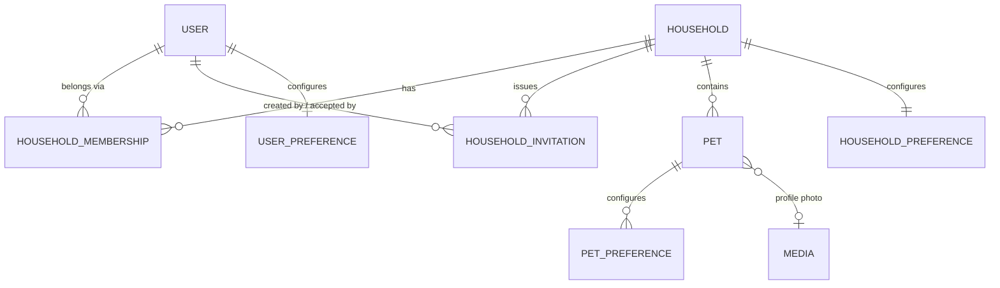
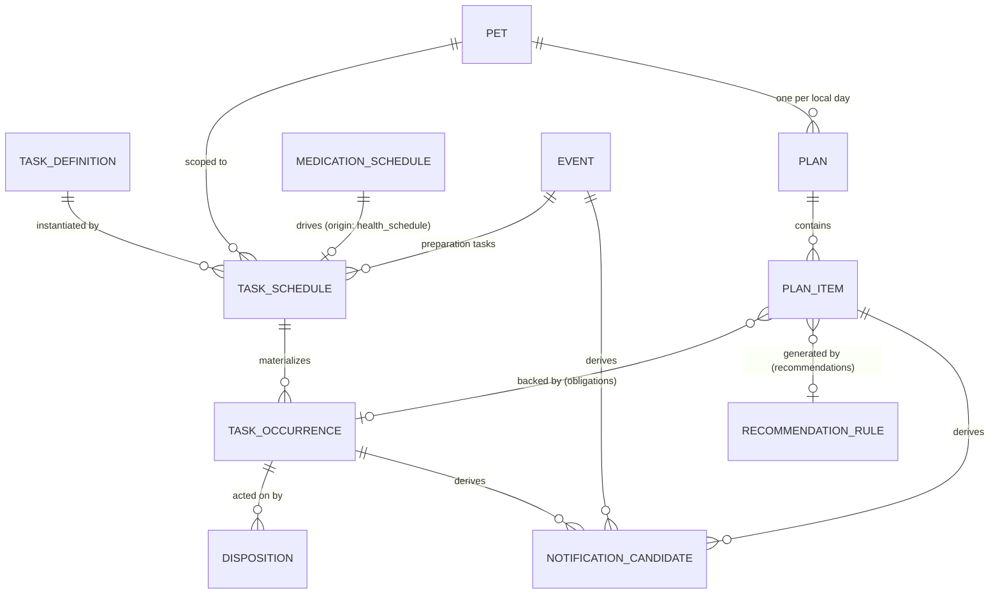
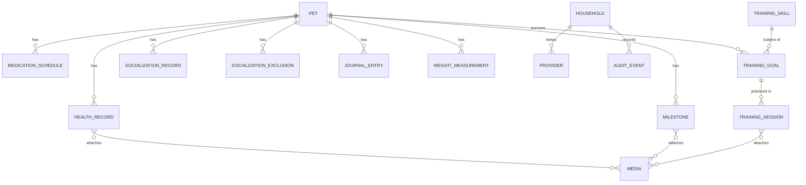

# Domain and Data Model

**Status:** Review  
**Version:** 1.0  
**Last updated:** 2026-07-26  
**Related documents:** [Product Requirements Document](00-product-requirements-document.md),
[Core Features](03-core-features.md), [User Stories](04-user-stories.md),
[Information Architecture](05-information-architecture.md),
[Daily Plan Engine](12-daily-plan-engine.md), [Decision Log](13-decision-log.md)

## 1. Purpose

This document defines PetCompanion's conceptual and logical data model: the
entities, relationships, ownership boundaries, lifecycle states, and invariants
that the MVP requires. It is precise enough that a coding agent can design a
schema and synchronization behavior from it without inventing product
semantics, while remaining implementation-neutral: it does not choose a
database vendor, framework, or cloud provider.

## 2. Scope

- All entities required by Slices A–E ([Core Features §20](03-core-features.md))
  and by [Daily Plan Engine §28](12-daily-plan-engine.md).
- Tenancy, authorization boundaries, and actor attribution.
- Date, time-zone, and recurrence semantics.
- The layered task model (definition → schedule → occurrence → plan item →
  disposition).
- Historical reproducibility, concurrency resolution, archival, audit, and
  analytics boundaries.
- Recommended invariants and constraints.

### Explicit exclusions

- Physical schema, indexing, table naming, and storage engine choice
  (→ [Technical Architecture](06-technical-architecture.md)).
- Sync transport and protocol design (→ Technical Architecture).
- The content of the rule/skill/stage catalogues themselves (→ content
  planning); this document models their *shape*.
- Deferred features: professional roles, multi-species specifics, wearables,
  AI features, marketplace.

## 3. Dependencies

- Obligation classes, origin types, plan sections, item lifecycle, priority
  tiers, and capacity modes are defined by the
  [Daily Plan Engine](12-daily-plan-engine.md) and are not redefined here.
- Role and permission behavior follows [Core Features F02](03-core-features.md).
- Screen-level usage of entities is mapped in the
  [Information Architecture](05-information-architecture.md).

## 4. Modeling conventions

These conventions apply to every entity unless stated otherwise.

- **Identifiers.** Every entity has a globally unique, non-guessable, stable
  identifier. Identifiers are never reused. Knowledge of an identifier must
  never grant access (F01 permissions). Client-generated identifiers are
  permitted where offline creation requires them, provided the server validates
  uniqueness.
- **Timestamps.** All instants are stored in UTC. Calendar-day semantics use an
  explicit **local date** plus the household's IANA time zone (see §8).
- **Actor attribution.** Every mutable household-owned record carries
  `created_at`, `created_by` (user id), `updated_at`, `updated_by`.
  Attribution survives the actor's later removal or account deletion (§7.3).
- **Revisions.** Entities that can be edited concurrently (schedules, events,
  profiles, notes) carry an integer `revision` incremented on every accepted
  write, used for optimistic concurrency (§13).
- **Soft deletion.** Household-owned records that synchronize use recoverable
  tombstones (`deleted_at`, `deleted_by`) for at least the synchronization
  window before any physical deletion (engine §23.2). Physical deletion
  policies belong to retention design (§16).
- **Idempotency.** Every client-initiated write that creates or transitions
  state carries a client-generated idempotency key; the server treats repeated
  keys as the same operation (US-107).
- **Field notation.** `?` marks optional fields. Enumerations are closed lists;
  extending one is a product decision, not an implementation convenience.

## 5. Tenancy and authorization model

### 5.1 Household tenancy (Proposed decision — see Decision Log)

The **household is the single tenancy and authorization boundary** for all
user-generated data. Every household-owned record carries a `household_id`,
directly or through an unambiguous parent chain (e.g., a TrainingSession
belongs to a Pet, which belongs to a Household). Authorization is evaluated at
the data layer on every read and write: the requesting user must hold an
*active* membership in the record's household (engine §18.5). UI-level hiding
is never the enforcement mechanism.

Three data domains exist:

| Domain | Examples | Access rule |
| --- | --- | --- |
| **User-owned** | User, UserPreference, notification settings, device registrations | Only the owning user |
| **Household-owned** | Pet, schedules, occurrences, records, media, plans, audit events | Active members of that household, per role |
| **Global content** | TaskDefinition (system), RecommendationRule, TrainingSkill, DevelopmentStageDefinition, SocializationCatalog, ContentVersion | Read-only to all users; writable only by the content pipeline |

Cross-household reads are impossible by construction: no query path may join
across households on behalf of a user, and exports are scoped to one household
(US-103).

### 5.2 Roles

MVP roles are `owner` and `caregiver` (full caregiver), with permissions
exactly as tabulated in [Core Features F02](03-core-features.md). The role
enumeration reserves `limited_caregiver` and `professional_readonly` for later
without any MVP behavior attached. Role checks gate: invitations, member
removal, ownership transfer, household close, pet archival/deletion, and
export initiation. All other household actions are available to both roles.

## 6. Entity-relationship overview

### 6.1 Identity, household, and pets



### 6.2 The task and plan layer



### 6.3 Care, training, and life records



## 7. Identity and household entities

### 7.1 User

**Purpose:** an individual caregiver's identity. One human, one account; never
shared (Accepted decision).

**Key fields:** `id`, `auth_provider_ref` (opaque link to the identity
provider), `display_name`, `status` (`active | deletion_pending | deleted`),
`created_at`.

**Relationships:** memberships (0..n), invitations created/accepted,
UserPreference (1), device registrations for notifications (0..n).

**Ownership & authorization:** user-owned. Only the user reads or edits their
account; other members see only `display_name` and role via membership.

**Lifecycle:** `active` → `deletion_pending` (confirmed deletion flow, US-004)
→ `deleted`. A sole household owner cannot enter `deletion_pending` until
ownership is transferred or the household is closed.

**Deletion:** personal fields are removed or anonymized per the published
policy; the `id` persists as an attribution tombstone. Household records
authored by the user are **not** deleted (they belong to the household);
attribution displays as a neutral former-member label once the account is
deleted. Active sessions are revoked when deletion begins.

**Audit:** account deletion, recovery events, and credential-level events (via
the identity provider) are auditable (US-003).

### 7.2 Household

**Purpose:** the shared tenancy unit containing pets, members, and all shared
records.

**Key fields:** `id`, `name`, `time_zone` (IANA), `status`
(`active | closed`), `default_capacity_mode`
(`normal | busy | essentials_only`), `created_at`, `created_by`.

**Relationships:** memberships, invitations, pets, providers,
HouseholdPreference, audit events.

**Lifecycle:** `active` → `closed` (owner-only, deliberate flow, US-104).
Closing cancels pending invitations and future notification candidates,
freezes plan generation, and starts the retention clock. Reopening is not an
MVP capability.

**Sync:** `time_zone` changes are material: they require user confirmation
when timed care would shift (engine §15.2), are audited, and apply
prospectively only (§8.4).

### 7.3 HouseholdMembership

**Purpose:** the authorization edge between a user and a household.

**Key fields:** `id`, `household_id`, `user_id`, `role`
(`owner | caregiver`, reserved: `limited_caregiver`,
`professional_readonly`), `status` (`active | removed | left`), `joined_at`,
`ended_at?`, `ended_by?`, `invitation_id?` (provenance).

**Invariants:** at most one `active` membership per (user, household); every
`active` household has ≥ 1 `active` owner at all times (transfer must commit
atomically with any owner departure, US-015).

**Lifecycle:** created by invitation acceptance or household creation →
`removed` (by owner) or `left` (by self). Terminal states are permanent; a
returning caregiver gets a *new* membership via a new invitation, preserving
the historical record.

**Authorization effects:** every server-side check reads the *current*
membership status — including for writes queued offline before removal
(Scenario F). Ending a membership invalidates the member's sessions'
household access on the next request and cancels that user's pending
notification candidates for the household.

**Audit:** creation, role change, removal, leaving, and ownership transfer are
mandatory audit events.

### 7.4 HouseholdInvitation

**Purpose:** the single-use, expiring instrument for adding a caregiver
without credential sharing (US-011, US-012).

**Key fields:** `id`, `household_id`, `created_by`, `token_hash` (the share
token is stored only as a hash), `role_granted` (`caregiver` in MVP),
`expires_at`, `status`
(`pending | accepted | declined | revoked | expired`), `accepted_by?`,
`resolved_at?`.

**Lifecycle:** `pending` → exactly one of `accepted | declined | revoked |
expired`. Terminal states are permanent. Acceptance atomically creates one
active membership; the same token can never create a second (idempotent
acceptance: re-submitting a completed acceptance returns the existing result).

**Authorization:** creation and revocation are owner-only (MVP). Before
acceptance, an invitation exposes only household name, inviter display name,
and expiry — never pet or record data.

**Audit:** create, revoke, accept, decline are audit events. Repeated create
submissions are idempotent (US-011).

### 7.5 Pet

**Purpose:** the subject of all care, training, and memory records.

**Key fields:** `id`, `household_id`, `name`, `species` (`dog` in MVP; field
exists for lifelong flexibility), `breed_text?`, `sex?`, **birth information**
(§8.2): `birth_date_kind` (`exact | estimated`), `birth_date?` (when exact),
`estimated_age_weeks?` + `estimated_as_of_date?` (when estimated),
`homecoming_date?` (may be future), `stage_override?` (explicit stage when age
is insufficient, engine §11 step 1), `profile_photo_media_id?`,
`food_notes?`, `allergy_notes?`, `microchip_ref?`, `notes?`,
`primary_provider_id?`, `status` (`active | archived`), `revision`.

**Relationships:** all pet-scoped records in §9–§12; plans; schedules.

**Validation:** `homecoming_date ≥ birth_date` when both exact (F03 failure
states); a future `birth_date` is rejected in MVP.

**Lifecycle:** `active` → `archived` (confirmed flow, US-025). Archival stops
plan generation, occurrence materialization, and notification candidacy for
the pet, and cancels its pending candidates. History remains readable to
members. Restoration returns the pet to `active` and resumes schedules
*prospectively* — no back-filled occurrences are created for the archived
period. Permanent deletion is a separate deliberate flow (ST-07) governed by
retention policy; it removes pet records and associated media per §16.

**Audit:** archive, restore, permanent delete, birth-date changes, and
homecoming-date changes are audit events (they alter guidance).

### 7.6 Preferences (HouseholdPreference, UserPreference, PetPreference)

**HouseholdPreference** (1 per household): routine windows — broad local-time
bands for `morning`, `midday`, `afternoon`, `evening`, `sleep` (US-100); meal
and potty routine templates chosen at onboarding; default capacity mode;
locale. Exact times remain optional except for explicitly timed care.

**UserPreference** (1 per user, applies across their households):
notification settings — morning summary opt-in and allowed delivery window,
per-class enablement (engine §21.1), quiet hours (evaluated in the user's
current device time zone at delivery, §8.5), lock-screen detail level
(`discreet | detailed`, default discreet, US-109), completion-update opt-in
(default off, US-084); display units (weight).

**PetPreference** (0..1 per pet): paused recommendation categories,
suggestion-frequency adjustments, training-days-per-week target. These feed
engine eligibility and are household-owned.

**Authorization:** UserPreference is user-owned; the others are
household-owned. One caregiver's changes never alter another's
UserPreference (US-101).

## 8. Time, dates, and recurrence semantics

### 8.1 Local day

The **local day** is the calendar date in the household's configured time
zone, bounded by midnight (engine §15.3). All of the following are stored as
local dates (not instants): plan date, occurrence due date, health-record
effective dates, milestone dates. Each Plan additionally snapshots the time
zone used at generation, so historical plans stay interpretable after a
time-zone change. The late-night "prior waking day" exception (engine §15.3)
is deferred unless a concrete schedule requires it; no MVP entity models it.

### 8.2 Exact versus estimated dates (Proposed decision — see Decision Log)

Birth information is a tagged structure, never a bare date:

- `exact`: `birth_date` is authoritative; age is derived from it.
- `estimated`: stored as `estimated_age_weeks` **as of**
  `estimated_as_of_date`. Age at any later date is derived by elapsing time
  from the reference date — the estimate ages correctly without pretending a
  birthday exists. Display language must qualify ("about 14 weeks", US-021).

Replacing an estimate with an exact date is an audited edit that triggers
controlled plan recalculation (US-023): future guidance recalculates;
historical plans are untouched. The same kind/precision pattern applies to any
future date that can be approximate; MVP applies it only to birth information.
Vaccination `next_due` dates are stored only when explicitly known — never
computed by the product (US-070).

### 8.3 Timestamps and effective times

Every disposition records both `recorded_at` (when logged, UTC) and
`effective_at` (when it actually happened). `effective_at` defaults to
`recorded_at`; back-dating (US-056) is allowed within bounds: not in the
future, and not more than **7 local days** before `recorded_at` (configurable
constant; older corrections go through an explicit history-correction flow).
Interval-based schedules consume `effective_at`, prospectively only (§8.6).
Media stores `capture_time?` (from metadata, when available) separately from
`uploaded_at` (F12).

### 8.4 Time-zone changes and DST

- Household time-zone edits apply prospectively: existing occurrences keep
  their local wall time in the new zone from the moment of change; historical
  local dates and stored instants are never rewritten. If the change would
  shift timed required care occurring within the next 24 hours, the edit flow
  requires confirmation (engine §15.2).
- DST transitions: local dates are unaffected; timed items keep their local
  wall time. A wall time that does not exist on a transition day resolves to
  the first valid instant after it; a repeated wall time resolves to the first
  occurrence. These two rules are fixed product behavior, not implementation
  choice, and belong in the scenario suite (engine §27).

### 8.5 Whose time zone, where

| Concern | Time zone |
| --- | --- |
| Plan generation, local dates, day boundary | Household |
| Occurrence due times and windows | Household |
| Quiet hours, morning-summary window | The receiving user's current device zone |
| Displayed timestamps ("at 7:42 AM") | Viewer's device zone, with household-zone disambiguation only when they differ materially |

### 8.6 Recurrence semantics

`RecurrenceRule` is a value object embedded in TaskSchedule (and
MedicationSchedule), not a shared table:

**Fields:** `type`, `interval?`, `weekdays?`, `day_of_month?`, `anchor_date`
(first eligible local date), `count?` (finite series), `until?` (end local
date), `time_policy` (`exact_time | window | anytime`), `exact_time?` or
`window_ref?` (a HouseholdPreference band).

**Types and materialization rules** (from
[Core Features F05](03-core-features.md)):

| Type | Semantics |
| --- | --- |
| `once` | Single occurrence on `anchor_date` |
| `daily` | Every local day from anchor |
| `weekdays` | Each listed weekday |
| `every_n_days` | Anchor, then every `interval` local days |
| `weekly` | Same weekday as anchor |
| `monthly_safe` | On `day_of_month`; when the month lacks that day, the **last day of the month** (the "safe calendar policy" — fixed here) |
| `interval_after_completion` | Next occurrence due `interval` days after the most recent completion's `effective_at` local date; exactly one open occurrence exists at a time |
| Finite series | Any type above bounded by `count` or `until` |

**Materialization is deterministic and idempotent** (F05 acceptance): each
occurrence's identity is its `occurrence_key` (§9.3):

- **Calendar-based types** (`once`, `daily`, `weekdays`, `every_n_days`,
  `weekly`, `monthly_safe`, and finite series of these):
  `occurrence_key = (schedule_id, original_local_due_date)` — the date the
  rule generated, which never changes. Rescheduling moves the occurrence's
  `local_due_date` but leaves its key untouched, so a moved occurrence keeps
  its identity and the vacated date is never re-materialized.
- **`interval_after_completion`:** `occurrence_key = (schedule_id, ordinal)`,
  where `ordinal` is the count of prior occurrences of that schedule. Exactly
  one open occurrence exists at a time; the next materializes only when the
  current one resolves.

Series edits split schedules (below), so a new rule always means a new
`schedule_id` — keys from the old and new rule can never collide. Re-running
materialization for any window therefore produces the same keys, and
regeneration can never duplicate (US-041, engine §10.1). Calendar-based
occurrences are materialized within a bounded forward window (recommended
default: 14 days; a Technical Architecture tunable) plus on-demand for
calendar browsing; `interval_after_completion` schedules materialize exactly
their next occurrence regardless of window.

**`interval_after_completion` and back-dating:** a back-dated completion
recomputes the *next* due date only. Already-elapsed periods are never
back-filled with synthetic missed occurrences, and an already-materialized
future occurrence moves rather than duplicates (US-056 "predictably").

**Series edits ("this and future", US-055):** editing future occurrences
**splits the schedule**: the existing schedule's `until` is set to the split
date (exclusive) and a successor schedule (`supersedes_schedule_id` set) is
created from the split date with the new rule. Historical occurrences keep
their original schedule reference; notification candidates for the retired
range are cancelled. Editing a single occurrence modifies only that occurrence
(§9.3) and never touches the schedule. Unsupported patterns are rejected with
explanation — never silently approximated (US-051, US-071).

## 9. The task layer

The layered model (Proposed decision — see Decision Log) separates *what an
activity is*, *the intent to do it on a cadence*, *a dated instance*, *its
appearance in a plan*, and *what someone did about it*:

```text
TaskDefinition        what the activity is (reusable; user or catalogue)
  └── TaskSchedule    the household's dated/recurring intent (or a one-off)
        └── TaskOccurrence   one due instance on a local date
              ├── PlanItem   its presentation in a specific day's plan
              └── Disposition  complete / skip / snooze / reschedule / undo …
```

Recommendations are PlanItems *without* a backing occurrence unless accepted
(§10.3). This mapping implements the PRD §15 requirement to distinguish
catalogue content, templates, scheduled instances, and recorded outcomes.

### 9.1 TaskDefinition

**Purpose:** the reusable description of an activity ("Brush coat",
"Practice recall").

**Two provenances:** `user` (household-owned, created implicitly when a user
makes a task; editable by the household) and `system` (global content,
referenced by `content_id` + version; read-only). Fields: `id`, `provenance`,
`household_id?` (user provenance only), `title`, `category` (engine §8.1),
`default_obligation_class`, `instructions_content_ref?`, `default_effort`
(engine §13.2 bands), `default_time_policy`.

**Deletion:** user definitions are soft-deleted only when no schedule
references them; otherwise archived with the schedule.

### 9.2 TaskSchedule

**Purpose:** the household's intent to perform a definition — one-off or
recurring — and the generator of occurrences.

**Key fields:** `id`, `household_id`, `pet_id`, `task_definition_id`,
`recurrence` (embedded RecurrenceRule), `assignment_default`
(`unassigned | member:<user_id> | anyone`), `origin` (engine §8.3 origin
types), `origin_ref?` (e.g., `medication_schedule_id`, `event_id` for
preparation tasks), `obligation_class` (engine §8.2), `reminder_config?`
(lead times), `active_range` (`start_date`, `until?`),
`status` (`active | paused | archived | superseded`),
`supersedes_schedule_id?`, `revision`.

**Lifecycle:** `active` → `paused` (no materialization while paused; resuming
is prospective) → `archived` (stops future occurrences, cancels pending
candidates, history readable — US-078) or `superseded` (series split, §8.6).

**Authorization:** household members edit user-origin schedules. Schedules
with `origin = health_schedule` are edited only through their owning
MedicationSchedule (single source of truth); direct edits are rejected.

**Audit:** schedule edits, pauses, archives, and splits are audit events when
`obligation_class = required` or origin is `health_schedule`.

### 9.3 TaskOccurrence

**Purpose:** one dated instance that can be acted on.

**Key fields:** `id`, `occurrence_key` (unique; deterministic per §8.6),
`household_id`, `pet_id`, `schedule_id?` (null only for ad-hoc one-offs
created without a schedule — discouraged; the default path always has a
schedule with `type = once`), `local_due_date`, `original_local_due_date`
(the rule-generated date; part of the occurrence key; equals
`local_due_date` until rescheduled), `time_policy` + resolved
`due_time?`/`window?`, `assignment`, `state`, `obligation_class`, `origin` +
`origin_ref` (copied for stability), `revision`.

**States** (engine §16.1): `pending → completed | skipped | rescheduled |
cancelled | expired`. Two engine states map onto flags rather than lifecycle
states: `needs_attention` is *derived presentation state* (pending + past its
window + required), and **`snoozed` is a pending occurrence with an active
snooze annotation** (`snooze_until` from its latest snooze Disposition) —
consistent with engine §16.4, which defines snooze as reminder/display
emphasis that never changes the due date. Neither is stored as a lifecycle
state.
Transitions are effected only by Dispositions (§9.4) or by the end-of-day
close process (`expired` for recommendations-backed and lapsed scheduled
items per engine §17.3–17.4). Rescheduling *moves this occurrence* (updates
`local_due_date`, keeps identity and history, sets
`original_local_due_date`) — it never clones (US-054).

**Invariants:** `occurrence_key` unique; an occurrence's `local_due_date`
falls within its schedule's active range; no occurrence exists for an
archived pet or archived schedule with a due date after the archival.

### 9.4 Disposition

**Purpose:** the append-only record of every user action on an occurrence —
the household's trustworthy shared history and the basis of attribution.

**Key fields:** `id`, `occurrence_id`, `action` (`complete | undo_complete |
skip | undo_skip | snooze | reschedule | cancel | dismiss_required`),
`actor_user_id`, `recorded_at`, `effective_at` (§8.3), `note?`,
`skip_reason?` (optional enumeration, engine §16.3), `snooze_until?`
(same-day instant; display emphasis only, US-053), `reschedule_to?`,
`media_refs?`, `client_idempotency_key` (unique), `superseded` (bool, for
duplicate completions), device/sync metadata.

**Completion convergence rule:** an occurrence has at most one *effective*
completion. When concurrent completions synchronize, the one with the
earliest valid `effective_at` becomes effective; later duplicates are stored
with `superseded = true` for audit and are invisible in normal UI (engine
§18.3, Scenario C). `undo_complete` appends a disposition, clears the
effective completion, and returns the occurrence to `pending` (US-033); the
prior completion remains in history.

**Notes:** disposition notes are append-only per author; concurrent edits to
a note preserve both versions rather than merging destructively (US-057).
Note text is excluded from analytics (§17).

**`dismiss_required`** exists so a required item can be explicitly resolved
without completion (engine §10.4) — it requires a confirmation appropriate to
the item's source and is always audited. The product never auto-dismisses
required items.

## 10. The plan layer

### 10.1 Plan

**Purpose:** the single shared plan for one pet on one local day, and the
anchor for historical reproducibility.

**Key fields:** `id`, `household_id`, `pet_id`, `local_date`,
`time_zone_snapshot`, `stage_snapshot` (stage key + definition version),
`capacity_mode_applied`, `plan_version` (int, incremented on each meaningful
regeneration, engine §10.2), `catalogue_version_set` (the exact
ContentVersion set used), `input_digest` (opaque digest of generation inputs
for reproducibility diagnostics), `recommendations_frozen_at?` (first
meaningful interaction, engine §10.3), `status` (`open | closed`),
`generated_at`.

**Invariant:** unique (`pet_id`, `local_date`). Generation is idempotent:
regeneration mutates the existing plan (new `plan_version`), never creates a
sibling.

**Lifecycle:** `open` during its local day; the day-close process marks it
`closed`, applies expiry dispositions, and freezes it. **Closed plans are
immutable**: later rule/content changes never alter historical plan items or
their stored explanations (US-040, engine §10.4). The plan's snapshots
(stage, catalogue versions, time zone, explanations rendered at generation)
are what make history reproducible after rules or content change.

**Freezing:** `recommendations_frozen_at` is set at the first *meaningful
interaction* of the local day, defined precisely as: the first disposition on
any of the plan's items, or the first explicit "replace/another idea"
request — a passive plan view does **not** freeze. After freezing, the
recommendation set changes only through user-initiated replace/pin actions.

### 10.2 PlanItem

**Purpose:** one entry in a plan — the unit the user sees and acts on.

**Key fields:** `id`, `plan_id`, `item_key` (stable across regenerations of
the same logical item, so user context survives `plan_version` bumps), `kind`
(`obligation | recommendation | informational | upcoming_preview`),
`occurrence_id?` (obligations), `recommendation_rule_ref?` (rule id +
version, recommendations), `title` (display text rendered at generation,
per engine §28.1 — stored, not re-resolved from content), `category`,
`obligation_class`, `priority_tier`
(engine §12.1), `section` (`needs_attention | today | recommended |
coming_up | completed`), `time_window?`, `effort_band?`,
`explanation_text` (rendered at generation from the rule's template — stored,
not re-rendered), `score_components?` (internal; never displayed, US-037),
`pinned` (bool), `display_state`.

**Rules:** obligations mirror their occurrence's state; recommendations live
and die with the plan — an unaccepted recommendation expires at day close and
is never carried forward as overdue (US-034, engine §17.4). A future day may
contain a *new* item from the same rule, subject to cooldown.

### 10.3 Accepting and pinning recommendations

Completing or pinning a recommendation promotes it to a real
occurrence: the system creates a `once` TaskSchedule (origin:
`development_rule` / `socialization_rule` / `training_program` per the rule)
plus its occurrence for today, links the PlanItem to it, and records the
disposition against the occurrence. This keeps *all* completions —
obligation or recommendation — in one uniform history (one completion model,
one attribution model, one idempotency model).

### 10.4 RecommendationRule (global content)

**Purpose:** the versioned, governed eligibility-and-content unit the engine
evaluates (engine §9.1 defines the required fields; this model stores exactly
that set, under ContentVersion governance).

**Key fields:** `content_id`, `version`, `name`, `category`,
`eligibility` (species, stage keys, age min/max, prerequisites, exclusions,
safety constraints), `cooldown_days`, `frequency_cap?`, `effort_band`,
`default_time_window`, `default_priority`, `explanation_template`,
`effective_from`, `retired_at?`, review metadata.

**Retirement:** retiring a rule stops *future* selection; historical plans
retain their stored explanation and rule version reference (engine §27 "rule
version retired").

### 10.5 DevelopmentStageDefinition (global content)

`stage_key`, `name`, ordered position, entry guidance (age-range bands, not
hard boundaries), focus areas, next-stage preview content, version, review
metadata. Pets derive their stage from birth information + these definitions,
with `stage_override` taking precedence when set. Plans snapshot the stage
and version used (F07: historical plans retain the stage used at the time).

## 11. Care and health entities

### 11.1 HealthRecord

**Purpose:** a dated care record of one of the MVP types
([Core Features F10](03-core-features.md)): `vaccination | preventive_care |
appointment_note | grooming | general_note | document`. (Weight and
medication are modeled separately below; appointments are Events.)

**Common fields:** `id`, `household_id`, `pet_id`, `type`, `effective_date`
(local), `provenance` (`owner_entered | professional_instruction`),
`provider_id?`, `note?`, `media_refs?`, `archived` (bool), `revision`, actor
metadata.

**Type-specific fields:** vaccination — `vaccine_name`, `next_due_date?`
(only when explicitly known; never computed). Grooming — `activity_type`.
Document — `title`, media ref required.

**Authorization:** household-private; health data never leaves the household
boundary and is excluded from analytics (§17).

**Lifecycle:** editable; archival hides from default lists without deleting.
Duplicate vaccinations are surfaced for review, never auto-merged (US-070).

**Audit:** edits to `professional_instruction` records are audited; the
product never alters professionally sourced content (F10).

### 11.2 MedicationSchedule

**Purpose:** the authoritative record of a medication instruction and the
source of its occurrences. The highest-sensitivity entity in the product.

**Key fields:** `id`, `household_id`, `pet_id`, `medication_name` (as
entered), `dose_text?` (exactly as entered — the product never computes,
converts, or suggests a dose), `instructions_text?`, `provenance`
(`owner_entered | professional_instruction`), `provider_id?`, `recurrence`
(embedded; supported types only — unsupported clinical patterns are rejected
with a manual-entry fallback, US-071), `times`, `status`
(`active | archived | superseded`), `superseded_by?`, `revision`.

**Relationship:** owns exactly one TaskSchedule (origin `health_schedule`,
obligation class `required`); all edits flow through the MedicationSchedule,
which updates its TaskSchedule transactionally.

**History:** full change history is mandatory (F10 "preserve change history
for medication and critical schedules") — every edit produces an AuditEvent
with before/after field values; superseding preserves the prior schedule
intact.

**Missed occurrences:** surface as needs-attention with original due time and
source; the model stores no "missed-dose advice" of any kind (US-073, engine
§17.2).

### 11.3 WeightMeasurement

`id`, `pet_id`, `household_id`, `value` + `unit` (original precision and unit
preserved; conversions are display-time only, US-075), `effective_date`,
`note?`, actor metadata. Append-mostly; entries are editable/deletable with
audit. Visualization is non-clinical presentation only.

### 11.4 Provider

Household-owned contact: `id`, `household_id`, `name`, `kind`
(`veterinarian | groomer | trainer | other`), `phone?`, `address?`, `notes?`.
Referenced by health records, medication schedules, events, and the pet's
primary-provider field. Soft-deleted; references from historical records
survive deletion.

### 11.5 Event

**Purpose:** a dated commitment — veterinary appointment, puppy class, or
other event (F11).

**Key fields:** `id`, `household_id`, `pet_id?` (pet-linked or
household-level), `kind` (`vet_appointment | class | grooming_visit |
other`), `title`, `start_date` (local) + `start_time?` + `all_day`,
`end_time?`, `location_text?`, `provider_id?`, `notes?`, `reminder_config`
(lead times), `status` (`confirmed | cancelled`), `revision`.

**Behavior:** appears in Coming up within the engine's lead window and in the
calendar; preparation TaskSchedules reference it via `origin_ref`.
Rescheduling updates the event in place (revision check), cancels stale
notification candidates, creates new ones, and leaves completed preparation
tasks completed (US-086, Scenario G). Cancellation retains the record and
cancels dependent pending preparation occurrences and candidates.

## 12. Training, socialization, and life entities

### 12.1 TrainingSkill (global content)

Versioned content: `content_id`, `version`, `group`
([Core Features F08](03-core-features.md) groups), `title`, `steps`,
`prerequisite_skill_refs`, `stage_guidance`, `effort_band`,
`recommended_frequency`, `common_mistakes`, `safety_notes?`, `media_refs?`,
review metadata.

### 12.2 TrainingGoal

**Purpose:** a pet's active pursuit of a skill (the household's selection,
US-061).

**Key fields:** `id`, `household_id`, `pet_id`, `skill_ref` (content id;
sessions pin versions individually), `status`
(`active | paused | retired`), `progress_state` (the seven owner-reported
states, F08), `started_at/by`, `paused_at?`, `revision`.

**Invariant:** at most one non-retired goal per (pet, skill) — starting twice
is idempotent (US-061). `paused` excludes the goal from recommendation
eligibility (US-064); progress-state changes record actor and time (US-065)
and never occur without explicit user input (engine §19.2).

### 12.3 TrainingSession

`id`, `household_id`, `pet_id`, `goal_id`, `skill_ref` (id + version used),
`effective_date` (+ optional time), `duration_minutes?`, `outcome_note?`,
`progress_state_after?` (explicit user selection only), `media_refs?`, actor
metadata, `client_idempotency_key`. Sessions update recency for engine
cooldowns; a single session never auto-advances mastery (US-063).

### 12.4 Socialization entities

**SocializationCatalog (global content):** categories (the eight F09
categories) and suggested experiences with reviewed caution content, versioned.

**SocializationRecord:** `id`, `household_id`, `pet_id`, `experience_ref?`
(catalogue) or `custom_label?`, `category`, `effective_date`, `context?`,
`response` (owner-reported enumeration, e.g.
`relaxed | curious | neutral | hesitant | fearful` — display language final
in design; never diagnostic), `note?`, `media_refs?`, actor metadata. Recent
records feed engine cooldowns (US-067).

**SocializationExclusion:** `id`, `pet_id`, `experience_ref` or `category`,
`reason` (`unavailable | unsuitable | paused`), `set_by/at`, `cleared_at?`.
Active exclusions are hard eligibility constraints (US-068); reversible.

### 12.5 Milestone, JournalEntry

**Milestone:** `id`, `household_id`, `pet_id`, `title`, `effective_date`,
`note?`, `media_refs?`, actor metadata. Saves independently of media success
(Scenario H).

**JournalEntry (P2):** same shape with free `text`; edits are conflict-safe —
concurrent versions both preserved (US-094). Text excluded from analytics.

### 12.6 Media

**Purpose:** photos (MVP), Care document PDFs, and videos (P2) attached to
household records. Life milestone attach stays image-only; Care document
notes may use `application/pdf` in addition to image MIME types.

**Key fields:** `id`, `household_id`, `pet_id?`, `uploaded_by`,
`storage_ref`, `mime_type`, `byte_size`, `capture_time?` (from metadata),
`uploaded_at`, `status`
(`pending_upload | available | upload_failed | removed`), `attachments`
(polymorphic references to owning records).

**Rules:** media inherits its household's authorization — never publicly
addressable (F12); a media item and every record it attaches to must share
one `household_id` (invariant). Upload failure leaves the parent record
saved with the media in `upload_failed`, individually retryable. Removal
(`removed`) detaches and schedules storage deletion per retention policy
without deleting the parent record (US-093); the flow never claims the
user's device copy is affected. Timeline ordering uses
`capture_time ?? effective date of the owning record`, not upload order.

## 13. Synchronization and concurrency resolution

Per-operation rules (engine §23.2), normative for implementation:

| Operation | Resolution |
| --- | --- |
| Completion (any disposition creating one) | Idempotent by `client_idempotency_key`; convergence per §9.4 (earliest valid `effective_at` effective, duplicates retained superseded); no user-facing error on convergence |
| Undo | Append-only disposition; last accepted undo wins; full history retained |
| Notes (disposition, journal) | Append/versioned; concurrent edits preserve both versions; no destructive merge |
| Schedule / event / profile edits | Optimistic concurrency on `revision`; a stale write is rejected and the conflict surfaced to the user with both versions — never silently overwritten (US-055, F06) |
| Deletes / archives | Recoverable tombstones during the sync window; a concurrent edit to a tombstoned record surfaces the conflict |
| Queued offline writes | Replayed with original `recorded_at`/`effective_at`; authorization re-checked server-side at apply time; rejected writes are reported to the user, not silently dropped (Scenario F) |
| Plan regeneration | Idempotent by (pet, local_date) + input digest; concurrent regeneration requests coalesce |

Offline capability floor (US-058): read the last-synchronized plan and
records; queue dispositions and simple notes on existing items. Creating
schedules/records offline is permitted (client-generated ids) but may be
deferred by Technical Architecture without violating this model.

## 14. Notifications

### 14.1 NotificationCandidate

**Purpose:** the persisted intent to notify one user about one thing —
derived from plans, occurrences, and events; delivery is a separate concern
(engine §21).

**Key fields:** `id`, `recipient_user_id`, `household_id`,
`occurrence_id?` **or** `event_id?` (mutually exclusive), `class`
(`task_due | task_snooze | event_reminder`), `source_ref` (occurrence /
event / plan), `scheduled_for` (instant), `dedupe_key` (unique — e.g. class
+ source + trigger; the "idempotency key" of US-083), `state`
(`scheduled | sent | cancelled | suppressed | failed`), `resolved_at?`.

**Rules:** candidates are cancelled when their source completes, cancels, or
reschedules (F11 "no stale notifications"). Event create/edit/cancel/archive
refresh via `refresh_event_notification_candidates` (US-086). Immediately
before delivery the sender re-verifies: item still active, not completed by
anyone, recipient still authorized, quiet-hours respected (with the explicit
time-sensitive exception, engine §21.4), and `dedupe_key` unsent (engine
§21.3). Failures of these checks record `suppressed` with a reason — giving
the F14 stale-notification guardrail its data.

### 14.2 NotificationDelivery

Per-attempt log: candidate ref, channel, attempted_at, outcome. Content
rendered per the recipient's lock-screen detail preference; health details
appear only with explicit opt-in (US-109). Delivery records retain no
free-text health content.

## 15. Audit model

### 15.1 AuditEvent

Append-only, household-scoped, immutable: `id`, `household_id`,
`actor_user_id?` (null for system actions), `entity_ref` (type + id),
`action`, `summary` (structured before/after for audited fields),
`occurred_at`, `reason?`. Not user-visible in normal UI (engine §24);
readable by support/diagnostics under access controls defined in Technical
Architecture.

### 15.2 Records requiring audit history

Mandatory (F06, F10, stories as cited):

- Membership lifecycle, role changes, ownership transfer (US-014, US-015)
- Invitations: create, revoke, accept, decline
- Medication schedule create/edit/archive/supersede — field-level (§11.2)
- Required-obligation schedule edits and `dismiss_required` dispositions
- Pet birth/homecoming/stage-override changes, archive, restore, delete
- Household time-zone change, close; account deletion start/finish
- Completion corrections (undo, back-dated effective times)
- Export creation and delivery (US-103)
- Superseded duplicate completions (retained on the Disposition itself)

Ordinary completions, notes, sessions, and media additions are *attributed*
(actor + timestamps on the record) but do not need separate AuditEvents.

## 16. Deletion, archival, and retention summary

| Entity | Archive behavior | Delete behavior |
| --- | --- | --- |
| User | — | Anonymize personal fields; attribution tombstone; sole-owner guard (§7.1) |
| Household | Close: freeze generation, cancel candidates/invitations | Retention-clocked purge of all household data incl. media (policy TBD in §19) |
| Pet | Stops plans/occurrences/notifications; history readable; prospective restore | Deliberate flow; removes pet-scoped records + media per retention policy |
| Schedules | Stop future occurrences; cancel pending candidates; history intact | Soft-delete only; never physical while referenced |
| Occurrences/Dispositions/Plans | Never user-deleted; closed plans immutable | Purged only with pet/household deletion |
| Media | `removed` detaches + schedules storage deletion | With parent scope deletion |
| AuditEvent | Immutable | Purged only with household deletion, last |

All destructive flows must state their scope before confirmation (F13); every
deletion path defines what analytics/diagnostic traces are also removed or
anonymized (F14).

## 17. Analytics boundary

Data that must never enter ordinary product analytics (F14, US-057, US-077):

- Free-text anywhere: notes, journal text, health observations, instructions
- Medication names and dose text; vaccine names (use record *type* only)
- Media content and media metadata beyond counts/sizes
- Provider names and contact details; location text
- Invitation tokens; identifiers usable to join across households
- Notification body content

Analytics events reference structured metadata only: entity types, categories,
obligation classes, dispositions, counts, latencies, capacity modes, and
anonymized/pseudonymous ids consistent with the privacy policy. Operational
diagnostics that must touch sensitive records (e.g., sync-conflict debugging)
are a separate, access-controlled channel (F14 separation).

## 18. Invariants and recommended constraints

Enforce at the data layer wherever the chosen store allows; otherwise in the
single write path, with scenario tests:

1. One active membership per (user, household); every active household has at
   least one active owner.
2. Invitation tokens are single-use; acceptance creates exactly one
   membership, atomically.
3. Unique (pet, local_date) Plan; unique `occurrence_key`; unique
   `client_idempotency_key` per actor; unique notification `dedupe_key`.
4. At most one effective (non-superseded) completion per occurrence.
5. Pet birth information: exactly one of exact/estimated shapes populated;
   `homecoming_date ≥ birth_date` when both exact.
6. Occurrence due dates lie within their schedule's active range; no new
   occurrence/plan/candidate for archived pets, archived schedules, or closed
   households.
7. Health-schedule TaskSchedules are writable only via their
   MedicationSchedule.
8. Media and all records referencing it share one household.
9. Closed plans and AuditEvents are immutable; audit is append-only.
10. Every household-owned mutable record carries actor + timestamp metadata;
    every record reachable from a household carries or inherits its
    `household_id`.
11. PlanItems reference only published (non-draft) content versions; stored
    explanations are never re-rendered after generation.
12. `dismiss_required` and back-dated completions always produce an
    AuditEvent.

## 19. Open implementation decisions (deferred to Technical Architecture)

1. Plan generation location: server, device, or hybrid (engine open question).
   This model supports all three — generation needs only the entities above
   plus the content catalogue; reproducibility comes from plan snapshots, not
   from where generation runs.
2. Storage engine(s), schema mapping, and indexing.
3. Sync transport: this model assumes an operation-queue design with
   idempotency keys and per-operation resolution (§13); CRDT-style merging is
   neither required nor assumed.
4. Occurrence materialization window tuning and the day-close job design.
5. Push-notification infrastructure and token management.
6. Media storage, size limits for the private MVP, and thumbnailing.
7. Export format (documented, machine-readable, US-103) and delivery.
8. Retention windows: tombstone sync window, household purge delay, media
   deletion delay, audit retention.
9. Encryption-at-rest scope beyond platform defaults for health records.
10. Whether ad-hoc occurrences without schedules (§9.3) are permitted at all,
    or every one-off gets a `once` schedule (recommended: the latter, for
    uniformity).

## 20. Open product questions

1. Capacity setting per household or per pet (engine open question) — modeled
   here as household default + per-day plan override; per-pet capacity would
   move the field to PetPreference.
2. The back-dating bound (7 local days, §8.3) needs validation with the real
   household.
3. Response enumeration wording for SocializationRecord (§12.4) — design and
   content review.
4. Which content domains require named professional review before private use
   (engine open question) — gates ContentVersion publishing workflow.
5. ~~Whether Slice A needs the pre-arrival plan variant.~~ **Resolved
   2026-07-26:** it does (Decision Log); no model impact — the homecoming date
   already supports it.

## 21. Validation criteria

This model is validated when:

1. Every entity in [Daily Plan Engine §28](12-daily-plan-engine.md) and every
   concept in the PRD §15 list maps to an entity or an explicit merge decision
   here (PlanVersion → `Plan.plan_version`; Reminder →
   NotificationCandidate + reminder_config; Task → the §9 layer).
2. Each end-to-end scenario A–H in
   [User Stories §16](04-user-stories.md) can be walked through the model
   without requiring an undefined entity, state, or resolution rule.
3. The engine's edge-case checklist (§27) has a defined data behavior for
   every listed case (unknown birth date → §8.2; leap day / nonexistent date →
   §8.6 monthly_safe; retired rule → §10.4; removed member → §7.3/§13; etc.).
4. All invariants in §18 are expressible as constraints or single-write-path
   checks in the chosen stack.
5. A schema drafted from this document requires no product-behavior decisions
   beyond those listed in §19–§20.
